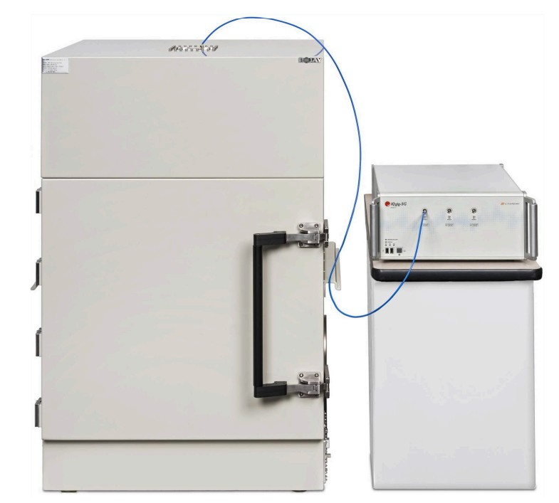
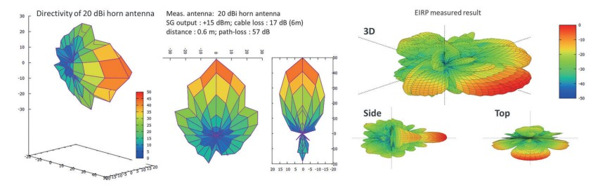
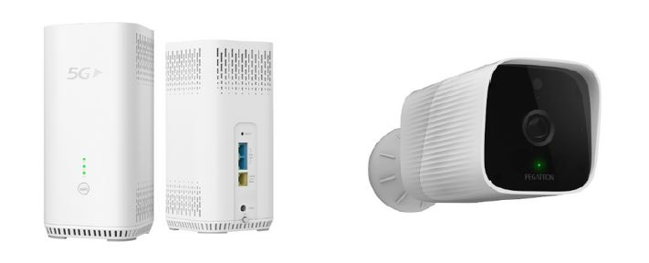

# Overview

Pegatron 5G develops a wide range of 5G infrastructure and user equipment, including O-RAN radio units, small cells, baseband units, and edge computing solutions. OTA testing is crucial for ensuring these products meet performance, certification, and interoperatibility standards, especially in high frequency scenarios.

## OTA Test

OTA (Over-the-Air) testing in NR5G is a method of evaluating wireless devices and base stations by measuring their performance through radiated signals, rather than direct cable connections. It's essential for verifying 5G functionality, especially in high-frequency bands and complex antenna systems. OTA testing involves sending and receiving signals wirelessly in a controlled environment to evaluate the performance of devices like smartphones, base stations (gNBs), and antennas. Unlike traditional conducted testing (via cables), OTA testing simulates real-world conditions by using radiated signals. 

A typical OTA test environment use an anechoic chamber to eliminates reflections and external noise.

## Why is OTA testing crucial for NR5G?

5G New Radio introduces several technologies that make OTA testing indespensable:
- **Massive MIMO (Multiple Input Multiple Output):** 5G uses large antenna arrays that dynamically steer beams. These cannot be tested effectively using conductive test.
- **Milimeter Wave (mmWave) Frequencies:** In FR2 (24.25–52.6 GHz), signal behavior is highly sensitive to physical orientation and environment, requiring radiated testing.
- **Integrated Antenna Modules:** Many 5G devices have no accessible RF connectors, making OTA the only viable test method

# Contribution

During the production in FATP (Final Assembly Test and Pack) stage, I contributed to the OTA verification process of several projects, such as:
- 5G Camera : NURA4K, MUSCAT
- 5G USB Dongle : MD200
- 5G FWA : MG36AX/MG18AX

The OTA verification process consist of several important stages:

## 1. Environment Setup

Over-the-Air (OTA) testing is a radiative measurement technique where the distance between the Device Under Test (DUT) antenna and the test antenna plays a critical role in determining measurement accuracy—particularly in terms of air loss. As the distance increases, the loss becomes higher, affecting the reliability of the measurements. However, placing the antennas too close is not ideal either, as each antenna has a defined radiative zone that must be respected to avoid distortion.

During the setup phase, it is essential to identify the optimal testing distance by collecting measurement data at multiple points and analyzing which position yields the most stable and reliable results. This process ensures accurate antenna characterization and enhances the overall integrity of the OTA testing procedure.

## 2. Test Program

The test program defines the sequence and parameters of the OTA measurements. It includes:
- Test Case Definition: Based on 3GPP standards (e.g., TS 38.521, TS 38.141), covering TRP, TIS, EIRP, and beamforming metrics.
- Device Configuration: DUT is set to specific operating modes (e.g., frequency band, bandwidth, modulation scheme).
- Automation Scripts: Scripts are developed to control the test equipment, DUT, and data logging systems.
- Calibration Procedures: Ensures all instruments and chambers are properly calibrated before testing begins.
This stage ensures consistency and repeatability across different test cycles and DUTs

## 3. Data Collection and Verification

Accurate data collection is critical to validate the DUT’s performance:
- Multi-Angle Measurements: Data is gathered across various spatial orientations to capture full radiation patterns.
- Real-Time Monitoring: Signal strength, throughput, and latency are monitored during active tests.
- Data Logging: All measurements are recorded with timestamps and configuration metadata.
- Verification: Results are compared against expected benchmarks and regulatory thresholds. Any anomalies are flagged for review.
This step confirms whether the DUT meets design and compliance requirements

## 4. Troubleshooting

When test results deviate from expected values, a structured troubleshooting process is applied:
- Signal Path Analysis: Check for cable losses, chamber reflections, or misalignments.
- Antenna Behavior: Investigate beamforming inconsistencies or gain pattern distortions.
- Software Logs: Review DUT logs for firmware or protocol stack issues.
- Retesting: Repeat measurements under controlled variations to isolate root causes.
Effective troubleshooting ensures that performance issues are resolved and that the DUT is ready for certification or deployment
