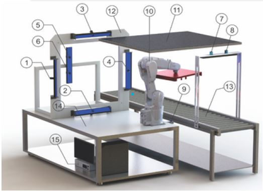

# Automated Optical Inspection

## Overview

An automated optical inspection system to inspect six-side metallic object. This project aims to develop a system that can provide a good quality of image. This system comprises of an industrial robotic arm and a set of cameras. An industrial robotic arm is involved to pick-up the object from the conveyor. Then, thesystem detected the orientation, shifted the position of the picked object, and calibratedthem to the reference orientation and position accordingly.

## Contributions

- Propose a scracth defect detection method by using image processing and deep learning technique.
- Design 3D model of the inspection system
- Test the communcation protocol of the industrial cameras
- Develop the main program of the inspection system based on C++