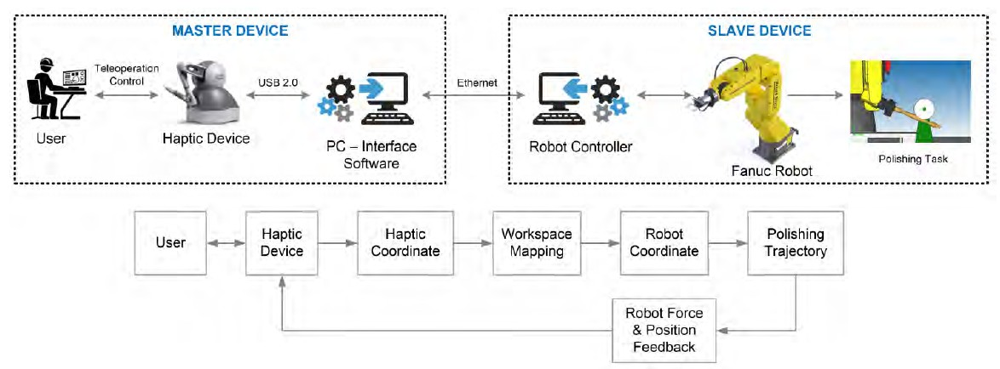

# Automated Robotic Polishing

## Overview 

This projects presents a haptic based robot teaching program for wooden furniture polishing. A haptic device is a manipulator that interacts with a user. The haptic senses the user's skill movements and make the user feel real to remotely polish the wood. The proposed polishing system involves a haptic device, an interactive teaching software, and a 6-DOF industrial robotic arm. The critical issue in a polishing task discussed in this project is how to design a teaching program to generate robot trajectory for various wooden workpiece shapes. 

The workspace mapping algorithm is implemented to solve the coordinate transformation between the haptic and the robot. The experimental result shows that the proposed method was successfully performed the wood polishing task.

[video: ../assets/videos/hexapod-sim.mp4]
