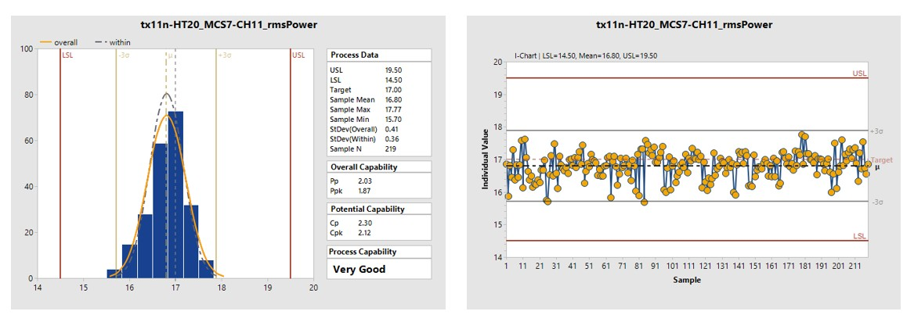
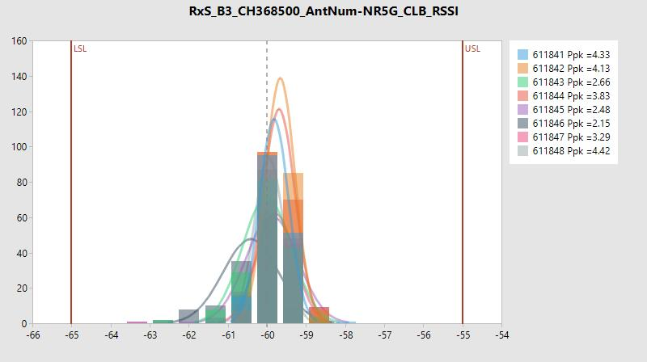
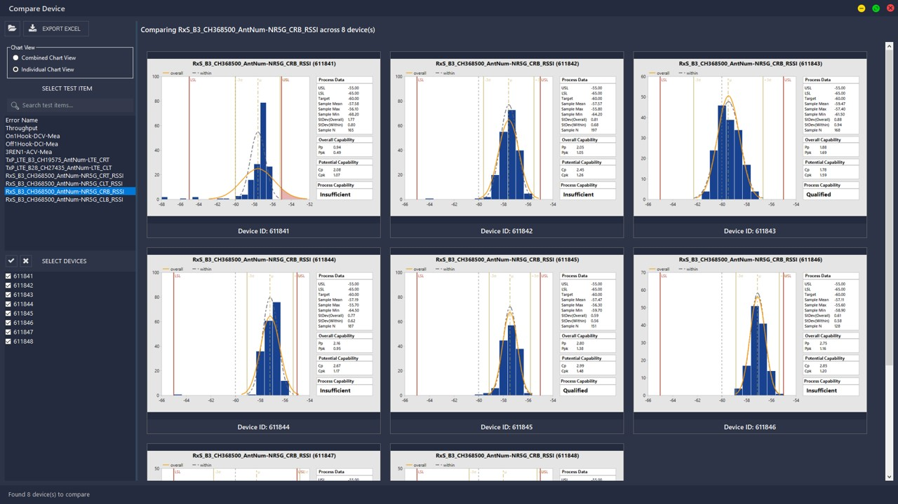

# Diglett - CPK Analysis Tool

## Overview

Diglett is an automated CPK (Process Capability Index) analysis tool designed for quality analysis process in production line. The tool retrieve data from production database, calculate the CPK value, and automatically generate the report file.

## Problem Statement

Engineers accross multiple factories in Batam, Taipei, Suzhou, can Vietnam needed to manually extract the test data and perform CPK calculations, which was time-consuming and prone to errors. This step involved extracting the data from multiple databases, manual data cleaning and preparation, complex CPK calculation, and generate report for customers.

## Solution

I developed Diglett as a comprehensive solution that:
- **Automated Data Query:** Connect the application with production line databases through FastAPI.
- **Real-Time Analysis:** Instant CPK calculations with statistical process controll
- **Multi-Factory Support:** Unified tool across Batam, Taipei, Vietnam, and Suzhou factories
- **Visual Reports:** Interactive chart and graph for easy interpretation
- **Export Capabilities:** Generate professional reports in Excel formats for customer review

Multiple devices comparison:

## Key Features

The application was built based on C# .NET Framework with a focus on performance and reliability.
- Multi-threaded data processing for large datasets
- Caching mechanism to reduce database load
- Configurable statistical parameters (Cp, Cpk, Pp, Ppk)
- Historical trend analysis
- Automated alerting for out-of-spec conditions
- User authentication and role-based access control
- Data logging

## Results & Impact

| Metric | Value | Description |
|--------|-------|-------------|
| Time Reduction | 70% | Reduced analysis time from 2 hours to 30 minutes |
| Factories | 4 | Used by engineers across Batam, Taipei, Suzhou, and Vietnam |
| Active Users | 100+ | Cross-department engineers using daily |

## Future Enhancements

- Machine learning integration for predictive quality analysis
- Web-based version for mobile access
- Integration with other production monitoring systems
- Advanced visualization with dashboard capabilities
- Real-time monitoring and alerting system

## Tags

`C#` ``.NET Framework``  ``FastAPI`` ``Statistical Analysis`` ``Data Visualization``