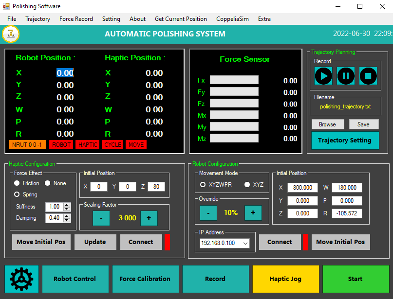

# Haptic Teleoperation with FANUC

## Overview

A software interface enabling haptic teleoperation of FANUC industrial robots using a 3D haptic device. Operators can intuitively control robot motion in 3D space with force feedback, enhancing precision and ease of use. Developed in C++ using FANUC's API and ROBOGUIDE for seamless integration.

Project link: [haptic-teleoperation-with-fanuc](https://github.com/yudarw/Haptic-Teleoperation-with-FANUC)